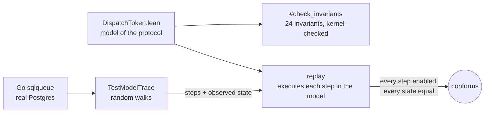
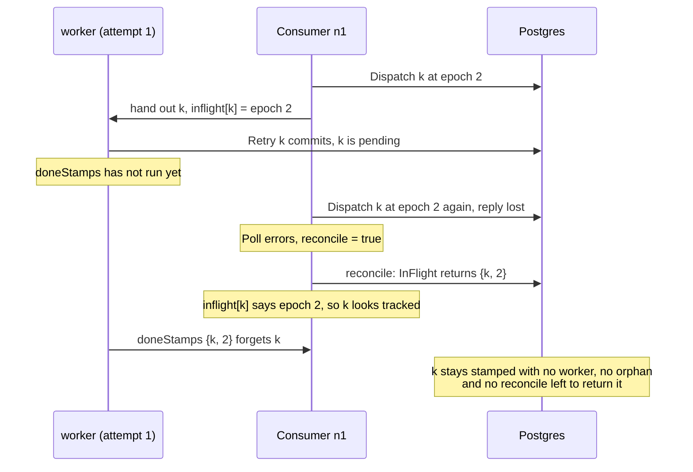

# llm-d-async-formal

[Veil](https://github.com/verse-lab/veil) (Lean 4) models of llm-d-async's
Postgres transport (`producer-sql/sqlqueue`, llm-d/llm-d-async#452): a proof
that no request can get stuck, and a check that the Go code behaves like the
proved model.



```
lake build
```

## What it found

Stamps were `{key, epoch}`, which names a lease tenure rather than a dispatch,
so bookkeeping left over from a finished attempt looked like a newer one. The
model checker's shortest counterexample on #452 at `4ed4210`:



Both this race and a second one (a `Poll` landing between `Retry`'s commit and
its bookkeeping) reproduce as failing Go tests against real Postgres. #452 fixed
them in `249c497` by giving every dispatch its own `dispatch_attempt` token.

## Models

Each Postgres statement is one atomic action. A `Consumer` method is split where
the Go code splits it: the store call commits, and its `c.mu` bookkeeping runs
later. Lease expiry is not modelled, so any node may take any partition at any
time. `no_stranded_row` says a row stamped under its partition's current epoch
always has something that will finish it or return it to pending: a tracked
worker, an orphan entry, a pending reconcile, or a `Poll` still booking it.

| Module | Protocol | Result |
| --- | --- | --- |
| `SqlQueue` | #452 at `4ed4210` | `#model_check` finds a stranded row. Two `sat trace`s reproduce `TestConsumerRetryBookkeepingKeepsTheAttemptPollHandedOut` and `TestConsumerReconcileIgnoresTheBookkeepingOfAFinishedRetry`. |
| `CycleLock` | `Retry` and `Undispatch` hold `c.cycle` | no violation in 71,889 states (2 nodes, 3 epochs, 3 attempts) |
| `DispatchToken` | every dispatch writes a fresh token that all fences and maps compare; #452 implements it as `dispatch_attempt` in `249c497` | no violation in 3,486,375 states, and `#check_invariants` proves all 24 clauses inductive across all 17 actions for unbounded nodes, keys, partitions, epochs and tokens |

`DispatchToken` sets `veil.smt.trust false` before `#gen_spec`, so cvc5's
answers are reconstructed into Lean proofs and checked by the kernel rather than
trusted. The option has no effect if set after `#gen_spec`.

The proof covers the model, not the Go code, and assumes each SQL statement is
atomic. It says every stranded row has a handler, not that the handler runs:
Veil does not prove liveness yet.

## Conformance

`scripts/conformance.sh` checks the Go code against the model:

```
TEST_POSTGRES_URL=postgres://... scripts/conformance.sh <llm-d-async checkout> [seeds]
```

`TestModelTrace` in `producer-sql/sqlqueue` drives real `Consumer`s against
Postgres with a seeded random walk: polls, acks, retries, undispatches,
rebalances, lease lapses, crashes, and writes that fail before committing. It
also splits operations where production runs them concurrently: a store call
now and its bookkeeping later, `AcquirePartitions` before the `ResetStale` of
the next rebalance, and a dispatch that commits under a `Poll` error. Test-only
triggers record statement order. Each operation is written out as the model
steps it performed and the state it left: the tables plus each consumer's
in-flight, orphan and reconcile bookkeeping.

`replay` runs those steps in `DispatchToken`'s executable semantics. Every step
must be enabled, and after every operation the model state must equal the
recorded one. 100 walks (8,100 operations, 44,742 model steps) conform.

Six injected bugs, each caught:

| Mutation | Traces rejected |
| --- | --- |
| `Ack` ignores the partition epoch | 1 / 100 |
| `Retry` ignores the owner | 1 / 400 |
| `Poll` keeps the orphan entry | 1 / 100 |
| `ResetStale` resets current-epoch rows | 84 / 100 |
| `doneStamps` ignores the attempt | 37 / 100 |
| `reconcileInFlight` trusts any tracked key | 5 / 100 |

The replay also found the model missing `pollFailed`: `Consumer.Poll` sets
`reconcile` on any `Dispatch` error, including one that never committed.
